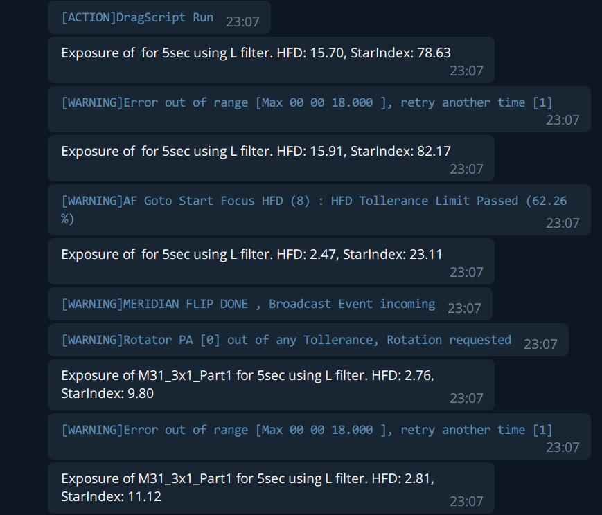
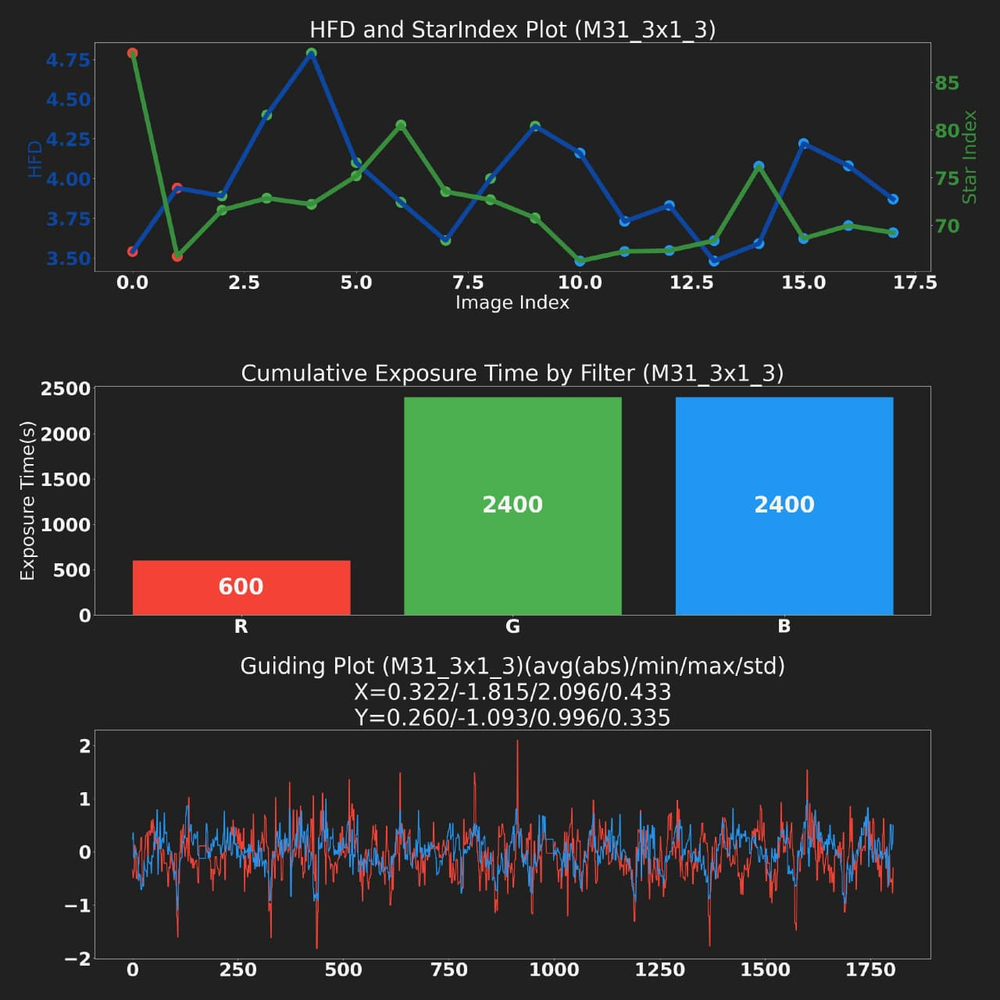
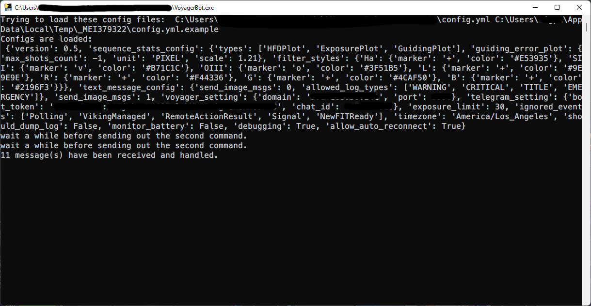

# VoyagerTelegramBot

by Liuyi Sun ([AstroBin](https://www.astrobin.com/users/liuyisun/)) and Kun
Wang ([AstroBin](https://www.astrobin.com/users/bigpizza/))

Last updates: 12/26/2021

> We just released `v0.2.2` for Windows users! 🎉 Download it [here](https://github.com/sly9/VoyagerTelegramBot/releases/tag/0.2.2)!

> Please visit our [discussion](https://github.com/sly9/VoyagerTelegramBot/discussions) page for any questions, suggestions, ideas and supports.

## Introduction

`VoyagerTelegramBot` is a lightweight client of Voyager Application Server. Unlike the
official [Web Dashboard](https://www.starkeeper.it/wdashinfo/),
`VoyagerTelegramBot` focuses on generating statistical charts and forwarding necessary messages
to [Telegram](https://telegram.org/).

With `VoyagerTelegramBot`, you don't need to keep a dashboard open to monitor the imaging session for sub-images, system
status, and critical warning and errors.

## Non-Affiliation and Disclaimer

This project is not affiliated, associated, authorized, endorsed by, or in any way officially connected with the `Voyager
– Astrophotography Automation Software`, or any of its subsidiaries or its affiliates. The official `Voyager – 
Astrophotography Automation Software` website can be found at https://software.starkeeper.it/.

## Features

- Configurable for types of images and messages
- Critical message forwarding

- Imaging session statistics per sequence

## A Guide for Everyone

> We have prepared an application for everyone using Microsoft Windows (64bit),
> please go to our [release](https://github.com/sly9/VoyagerTelegramBot/releases) page to download it.

Before following this guide, please make sure the application server is enabled on your Voyager. (***important***)

1. Create a Telegram account; ([check here](https://telegram.org/))
2. Create a bot for the `VoyagerTelegramBot`;
   ([check here](https://forum.starkeeper.it/t/send-free-custom-telephone-notifications-to-your-telegram-from-voyager/1889)
   , under `Send Telegram` part)
   > **KEEP YOUR BOT TOKEN SECURE !!!**
3. Please make your bot an administrator of the group(after adding it to the group), so that it can pin message and
   update graph.
    1. Instructions for telegram desktop app:
        1. Goto your group chat in telegram, click '...'
        2. click 'view group info'
        3. click '...' of the group info pop-up
        4. click 'Manage Group'
        5. click 'Administrators'
        6. search for your bot, and add and save
    2. Instructions for telegram on iPhone (Android should have similar exp?)
        1. Goto your group chat in telegram, and tap the group name on the top
        2. Tap 'Edit' on top right
        3. Tap Administrators
        4. Tap 'Add Admin'
        5. Choose your bot
        6. save and exit
4. Download the latest version of `VoyagerTelegramBot`
   from [release](https://github.com/sly9/VoyagerTelegramBot/releases).
5. Double click the downloaded file, and follow the prompt.

If everything goes well, you should see the main window of `VoyagerTelegramBot`.

## Full Installation Guide

Please refer to [Full Installation guide](doc/full_installation.md)

## Virus? Nah, you are safe(most likely)

For easier distribution purpose, we used [pyinstaller](https://github.com/pyinstaller/pyinstaller) to create a
standalone .exe file to save the hassle of unzipping the code, installing a compatible version of python, then 
install all the dependencies.

However, due to the fact that pyinstaller needs to extract all the content to a temporary folder and starts a python 
process, some antivirus programs might think it's an unsafe behavior, and blocks the app from running.

We are confident that our releases are clean and don't contain malicious code. However, as a disclaimer, we are **NOT** 
responsible for any possible harm and loss this bot might cause.

The false alarms for exe files built by pyinstaller is a known issue, and there's no easy way to totally get rid of it
-- see discussions [here](https://github.com/pyinstaller/pyinstaller/issues/5932) and 
[here](https://stackoverflow.com/questions/43777106/program-made-with-pyinstaller-now-seen-as-a-trojan-horse-by-avg).