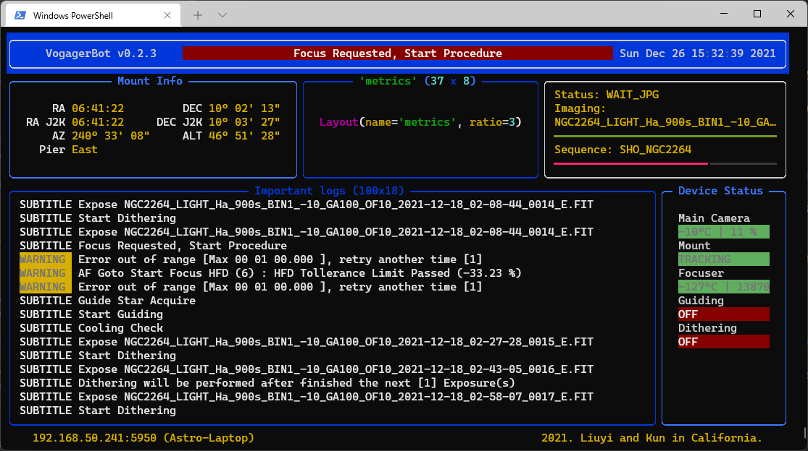

# VoyagerTelegramBot

by Liuyi Sun ([AstroBin](https://www.astrobin.com/users/liuyisun/)) and Kun
Wang ([AstroBin](https://www.astrobin.com/users/bigpizza/))

最后更新日期: 01/02/2022

> 我们刚刚为 Windows 用户发布了 `v0.2.5` 版本! 🎉 请点击 [这里](https://github.com/sly9/VoyagerTelegramBot/releases/tag/0.2.5) 下载!

> 如果您对我们的软件有任何疑问和建议，或者想支持我们的努力，欢迎访问 [讨论版](https://github.com/sly9/VoyagerTelegramBot/discussions) 。

## 软件介绍

`VoyagerTelegramBot` 是 `Voyager - Astrophotography Automation Software` 的一个轻量化监控工具。与官方推出的
[Web Dashboard](https://www.starkeeper.it/wdashinfo/) 不同，
`VoyagerTelegramBot` 主要目标是对拍摄进程进行实时监控，并将关键事件和拍摄统计通过实时消息的方式发到 [`Telegram Messenger`](https://telegram.org/) 客户端。
如果您是中国大陆🇨🇳的用户，使用本软件可能需要一些科学上网的相关配置。

## 非从属关系和免责声明

本软件开发完全出于个人的兴趣和爱好，我们与 `Voyager – Astrophotography Automation Software` 及其任何子公司或附属公司，或 与 `Telegram Messenger`
及其任何子公司或附属公司不存在任何关联，授权，认可或以其他任何方式连接。

- 如果需要了解更多关于 `Voyager – Astrophotography Automation Software` 的相关信息，请访问其[官方网站](https://software.starkeeper.it/) ；
- 如果需要了解更多关于 `Telegram Messenger` 的相关信息，请访问其[官方网站](https://telegram.org/) ；

## 主要功能

- 可配置的图片及消息类型
- 关键时间信息转发

- 拍摄进程基本信息统计图

## 适合所有人的简明使用教程

> 如果您使用64位 Microsoft Windows 操作系统，
> 欢迎访问我们的 [发布页](https://github.com/sly9/VoyagerTelegramBot/releases) 下载软件最新版。

在使用本软件之前，请确认 Voyager 软件中的 application server 设置已经启动。 (***非常重要***)

1. 创建 `Telegram` 账户; ([请参考](https://telegram.org/))
2. 为 `VoyagerTelegramBot` 创建 `Telegram` 消息机器人;
   ([请参考](https://forum.starkeeper.it/t/send-free-custom-telephone-notifications-to-your-telegram-from-voyager/1889)
   `Send Telegram` 章节)
   > **BOT TOKEN 是私人信息，请注意保密 !!!**
3. 请确保新建立的消息机器人在群组中为`管理员`，以满足发送和置顶消息的权限需求。

    - `Telegram` 桌面应用程序:

        1. 打开群组聊天, 点击 '...'
        2. 点击 'view group info'
        3. 点击 '...'
        4. 点击 'Manage Group'
        5. 点击 'Administrators'
        6. 找到你的消息机器人，并添加为管理员

    - `Telegram` iPhone 版 (安卓版应该也类似吧~)

        1. Goto your group chat in telegram, and tap the group name on the top
        2. 点击右上角 'Edit'
        3. 点击 'Administrators'
        4. 点击 'Add Admin'
        5. 选择你的消息机器人
        6. 保存并退出
4. 从 [下载页面](https://github.com/sly9/VoyagerTelegramBot/releases) 下载最新版 `VoyagerTelegramBot` 软件；
5. 双击下载好的 exe 文件运行程序。

如果一切顺利，您将看到 `VoyagerTelegramBot` 的主界面：

## 进阶版安装手册

> 适用于有一定python使用基础的用户 (适用于 Windows, Linux 和 Mac OS)

请参考 [Full Installation guide](doc/full_installation.md) (暂时只有英文版)。

## 软件报毒？ 多半是误报，我们的软件很安全。

为了方便没有软件开发经验 Windows 用户使用，我们使用 [pyinstaller](https://github.com/pyinstaller/pyinstaller) 来建立可直接运行 的 exe
文件，免去下载解压代码，配置运行环境的繁琐流程。

然而，由于 `pyinstaller` 软件本身需要对资源库进行解压和 `python` 进程调用操作，一些杀毒软件会误认为是不安全的行为，误认为我们的软件包含 病毒、木马或者其它恶意软件，阻止其运行。

我们对自己开发和发布的软件代码充满欣喜，良心保证没有因任何不良企图加入恶意代码。作为免责声明的一部分，我们也**不**对本软件造成的任何伤害或 数据丢失负责。

通过 `pyinstaller` 生成的可执行文件会触发杀毒软件的虚假警报是一个已知的 `pyinstaller` 软件缺陷，现在也并没有一个完美的解决方案可以避开
这个问题。详细信息请参考[这里](https://github.com/pyinstaller/pyinstaller/issues/5932) 和
[这里](https://stackoverflow.com/questions/43777106/program-made-with-pyinstaller-now-seen-as-a-trojan-horse-by-avg)
的相关讨论。